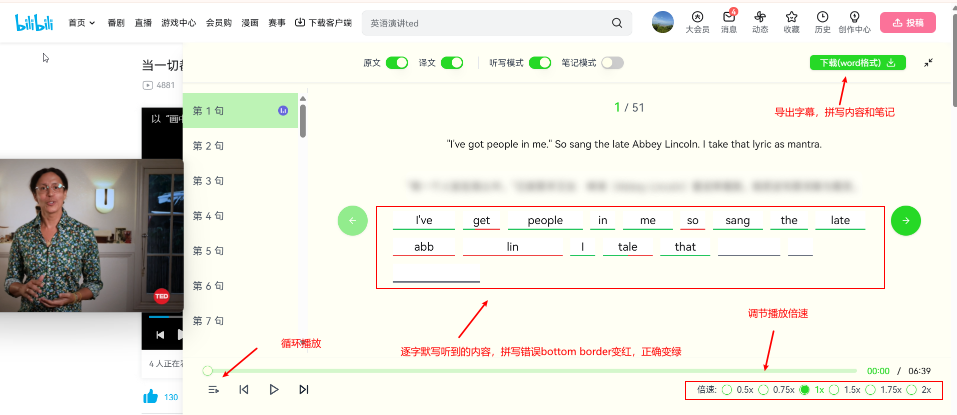
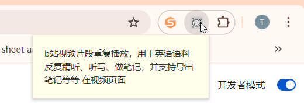
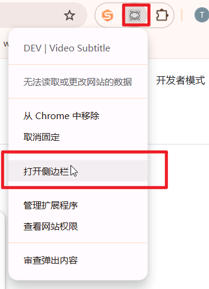
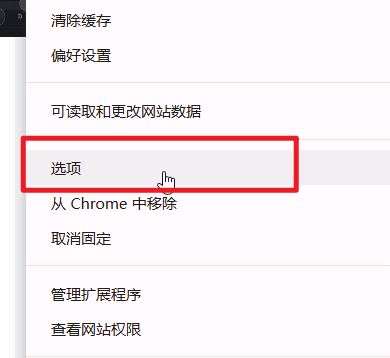
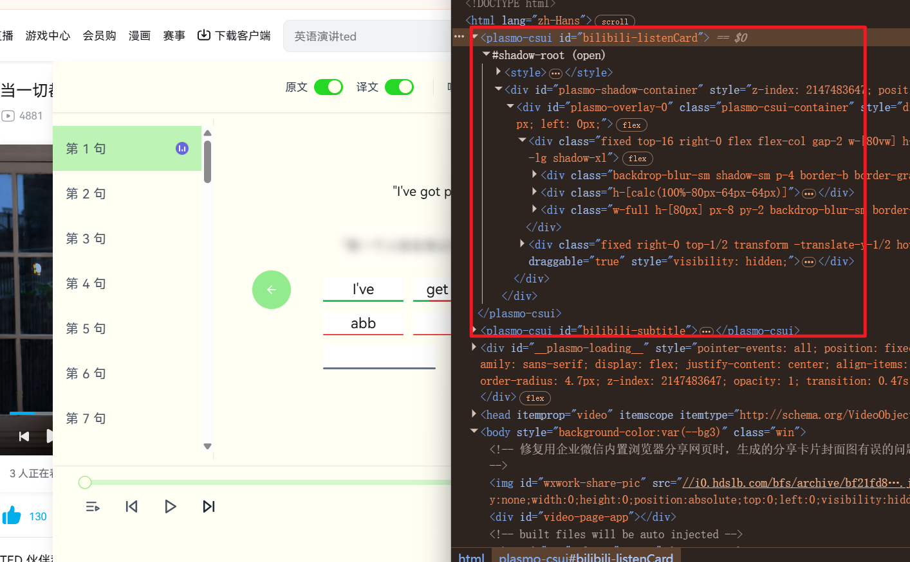
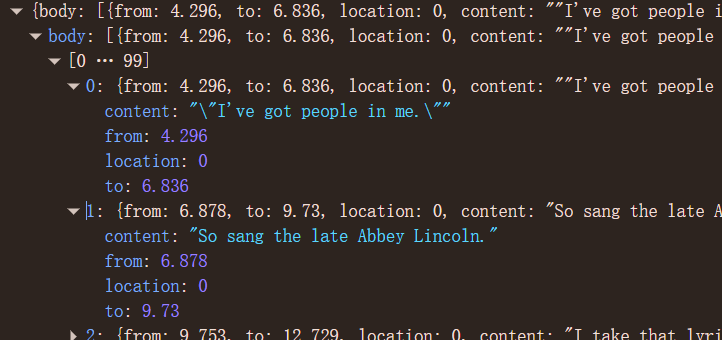

## 插件功能
  ### 已实现(仅针对b站视频)
   - b站视频字幕(得有字幕)的下载
   - 切成片段，可进行循环播放，倍速播放
   - 针对语言学习者有默写以及校验默写是否正确，和做笔记功能
   - 支持导出字幕、默写内容、笔记内容
   

  ### 待实现
  - 适配更多的平台，如油管，奈非，腾讯视频等
  - 支持针对无字幕的视频导入字幕文件
  - 支持本地持久化存储(下次打开同样视频之前的笔记内容都能显示)
  - 接入大模型，进行视频内容总结
  - 利用大模型实现语言转文字，适配所有无字幕的视频

## 浏览器开发框架
  [Plasmo(React)](https://juejin.cn/post/7257520279312498748) + [Tailwind CSS](https://www.tailwindcss.cn/docs/installation) + [Shadcn UI](https://www.shadcn-ui.cn/docs/installation)

## 浏览器插件的组成部分
  插件不同于web网站页面展示方式，插件有几个不同的组成部分
  1. poppup页面
    点击插图标显示除的弹出小窗就是popup页面
    
   在本项目中，popup在src/popup中定义(plasmo默认该路径下的页面是popup页面),目前没什么用，无需关注

  2. 侧边栏sidepanel
     鼠标右键点击插件图标后点击打开侧边栏，可打开侧边啦
     
     侧边栏在src/sidepanel(plasmo默认该路径)中定义，目前没有用到，无需关注

  3. 选项页面options
     经常使用选项页面来做一些配置，目前没用到，无需关注
     

   4. 内容脚本contents
     内容脚本是插件的核心，它是在页面上运行的脚本，它可以访问页面的DOM，修改页面的内容，监听页面的事件等等。
     内容脚本在src/contents中定义，每一个tsx文件都是一个内容脚本
     
     在该项目中内容脚本的dom插入到了b站html中，使能够在b站页面上层浮现内容脚本的内容

  5. service worker(后台脚本)
     后台脚本的主要作用是监听浏览器的事件，如浏览器的标签页变化，浏览器的扩展程序变化，浏览器的网络请求，不同插件的通信等等。
     后台脚本在src/background中定义，目前就只使用实现监听鼠标右键点击插件图标的功能

## plasmo
   plasmo替我们省去了繁琐的配置，使更加专注业务开发
   [脚本注入到页面的方式有两种](https://juejin.cn/post/7448464400765812787) 无需太关注

## 主要文件
├── src/
│ ├── background
│ │ ├── index.tsx # 后台脚本，实现了监听鼠标右键点击插件图标的，打开bilibili-listenCard功能
│ ├── components/ # React 组件
│ │ ├── ui/ # shadcn ui组件
│ │ ├── usePreventKeyboardPropagation.tsx # 防止一些键盘事件冒泡，避免和b站的键盘快捷键冲突
│ ├── lib/ # 工具函数库
│ │ ├── util
│ │ │ ├── getSubtitle.ts # 从b站视频中获取字幕，并格式化字幕数据
│ ├── contents/ # content script内容脚本
│ │ ├── bilibili-listenCard/ # 针对bilibili视频的听写+笔记页面脚本
│ ├── global.css # 全局样式
  
## b站字幕文件的格式

from: 开始时间
to: 结束时间
content: 字幕内容

## 相关资料
 [b站api文档](https://github.com/SocialSisterYi/bilibili-API-collect)
 [youtube 字幕下载](https://github.com/minhphuc010194/auto-download-subtitles-playlist-youtube/blob/main/src/index.js)

 [类似产品哔哔君](https://github.com/IndieKKY/bilibili-subtitle)
 [Bibigpt] (https://bibigpt.co/)

## 目前需要实现功能
  1. 实现本地化持久化存储
  2. 适配youtube平台

## 待讨论
  大模型对接方式
  1. 直接让用户自行购买大模型token, 手动对接
  2. 我们去download相关视频、音频，压缩，接入大模型提供商，然后返回结果
  3. 整个服务给大模型供应商，大模型供应商去下载视频，然后返回结果